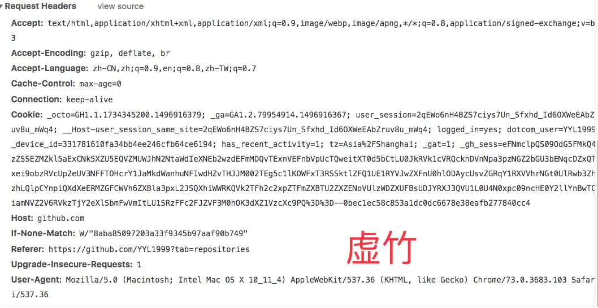
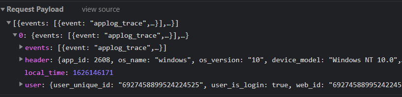
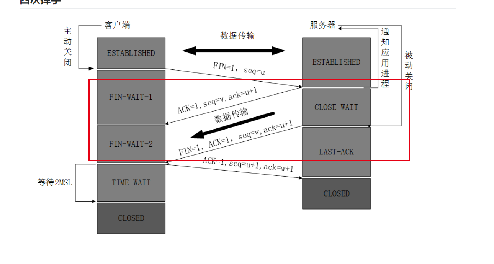

[浏览器输入url到显示的过程阐述？](https://github.com/ljianshu/Blog/issues/24)

[从输入 URL 到页面展示发生了什么？](https://juejin.cn/post/6931635435852529677#heading-31)

- 历史记录，书签进行匹配
- DNS 解析
- TCP 三次握手
- 发送请求，分析 url，设置请求报文(头，主体)
- 服务器返回请求的文件 (html)
- 浏览器渲染
  - HTML parser --> DOM Tree
    - 标记化算法，进行元素状态的标记
    - dom 树构建
  - CSS parser --> Style Tree
    - 解析 css 代码，生成样式树
  - attachment --> Render Tree
    - 结合 dom树 与 style树，生成渲染树
  - layout: 布局
  - GPU painting: 像素绘制页面


## 一. 读取浏览器内部的缓存

从历史记录，书签等地方找到已输入的字符串可能对应的url，给出智能提示，让你补全。

google浏览器甚至会在你没按enter键之前，直接就从缓存中把网页展示

## 二. DNS解析

先在本地的host文件中查找是否有对应的IP地址

——>没有就去翻本地的DNS缓存中有没有

——>第一次访问某个域名，本地的DNS缓存中肯定找不到，那就去DNS服务器进行查找

​	DNS服务器的查找顺序是从根域名服务器开始，一次向上递归查找

​	具体顺序如下：

>1. 询问根域名，获取顶级域名 .com 的 NS(Name Server) 和 A(Address)，NS为顶级域名的名字，A即NS对应的ip地址
>2. 询问顶级域名，获取二级域名 .tencnet.com 的NS 和 A
>3. 询问二级域名，获取三级域名 .cloud.tencent.com 的NS 和 A
>4. 询问三级域名，获取四级域名 .tlab.cloud.tencent.com 的NS 和 A
>5. 最后，将tlab.cloud.tencent.com的ip地址返回给用户，并且缓存
>6. 用户获取到真正的ip地址，并且缓存

## 三. 建立TCP连接

## 四. 发送HTTP请求

请求报文=请求行+请求头+请求体

请求行包括三个部分：请求方法，请求url和http协议的版本号

### 请求方法：

http1.1提供了8个请求方式：

​	GET; POST, HEAD; PUT, DELETE, PATCH, OPTIONS, TRACE

#### 着重讲下GET和POST的区别？

>- **GET和POST的区别**
>
>1. get只产生一个TCP数据包，POST产生两个
>   1. GET产生一个TCP数据包，浏览器会把http header和data一并发送，服务器响应200 OK并返回数据
>   2. POST产生两个TCP数据包，浏览器先发送http header，服务器响应100 continue，浏览器再发送data，服务器响应200 OK并返回数据（火狐只发送一次）
>
>2. 参数的问题
>
>   1. GET参数暴露在url中，不安全
>   2. GET在url中传参长度有限制，post没有
>   3. GET只接受ASCII字符，POST无限制
>   4. GET请求参数被完整保留在浏览记录中，POST的参数不会
>
>3. 从幂等性的角度来看，GET是幂等的，而POST不是
>
>   注意：幂等是指，同样的请求被执行一次与连续执行多次的效果是一样的，服务器的状态也是一样的。[参考这里](https://developer.mozilla.org/zh-CN/docs/Glossary/幂等)
>
>
>
>
>
>- **PUT和POST**
>
>  PUT和POST方法作用类似，不同在于PUT是幂等的。当多次发送相同的POST请求，服务器上的资源数目可能会增加；而PUT请求后服务器上的资源数目不会增加，每次PUT都会覆盖前一次PUT的资源
>
>


### 请求头




Accept：指定客户端可以接受哪些类型的信息

Accept-Encoding： 指定客户端接受的编码方式

`Connection：keep-alive` 告诉客户端不要立即关闭TCP连接，下次请求使用相同的通道，省去建立TCP连接的时间

`cache-control: no-store, no-cache, must-revalidate`

- public：响应会被缓存，客户端和服务端都可以缓存
- private：响应只能够作为私有的缓存，比如在一个浏览器中，不能在用户间共享，所以设置该参数后就不能被反向代理缓存了。
- no-cache：响应不会被缓存，而是实时向服务器端请求资源，这使得HTTP认证能够禁止缓存以保证安全性。实际中这个容易让人产生误解，字面理解是响应不被缓存，而实际上no-cache情况下也是会被缓存的，只是每次客户端都要向服务器评估缓存响应的有效性。
- no-store：在任何条件下，响应都不会被缓存，并且不会写入到客户端的磁盘里，这也是基于安全考虑的某些敏感的响应才会使用这个。
- max-age=［单位：秒］：设置缓存最大的有效时间，从服务端返回的时间开始计算。
- s-maxage=［单位：秒］：类似于max-age，但是它只用于共享缓存，比如代理。


no-cache是会发送if-none-match 请求头的

- no-store

  彻底禁用缓冲，所有内容都不会被缓存到缓存或临时文件中。

- no-cache

  在浏览器使用缓存前，会往返对比 ETag，如果 ETag 没变，返回 304，则使用缓存。

  

  

  **看这个链接，重新整理cache-control的参数问题：https://juejin.cn/post/6844903810897281038**


### 请求体




请求头中有一些与请求体相关的信息，比如`Content-Type: application/json`,设置请求体为JSON类型的文本


### http缓存

强缓存：expires（服务器过期时间点）和cache-control（服务器过期时长）

协商缓存：last-modified（过期时间点）和E-Tag（服务端数据被修改的最后一次，它的id）

对应客户端的分别是if-modified-since和if-none-Macth

```
Cache-Control: max-age=60
```

cache-control的指令有哪些？

常见的：public，private；max-age，s-maxage;  no-store, no-cache

public：服务器返回响应报文的时候，可以被CDN或者代理服务器缓存

private：只有响应的最终接收方（客户端或者浏览器）才可以缓存报文

max-age：指定最长过期时长（单位为s），即在这段时间中，从本地缓存读取数据而不需要重新验证或者重新获取数据。

s-maxage：只在cache-control中存在public指令的时候生效，一旦生效会覆盖max-age，也是指定过期时长。

np-store：优先级很高，表示不走任何缓存，强缓存和协商缓存都不走，每次都需要去请求服务器获取最新的响应体

no-cache：不会尝试读取强缓存中的副本，而是直接会去请求协商缓存。


## 五. 服务器处理请求并返回结果

响应报文 = 状态码 + 响应头 + 响应体


### 状态码

>100 continue: 服务器运转正常，客户端可以继续发送请求
>
>200 OK：客户端请求成功
>
>204 No Content：表示没有更新的文档，浏览器应该继续使用原来的文档
>
>301：永久重定向
>
>302：临时重定向
>
>304：命中协商缓存
>
>400：客户端请求语法错误，不被服务器所理解
>
>404：请求资源不存在
>
>500：服务器出错


## 六. 浏览器渲染

解析html生成DOM树

解析css生成CSSOM树

合并DOM树和CSSOM树，形成渲染树

浏览器开始渲染并绘制页面（回流和重绘）


## 断开连接

补充四次挥手

##### **为什么是四次挥手而不是三次？**



前一个表明我知道你发完了，我不再接收你的东西，第二次是告诉他我的东西发完了

四次是因为服务端的数据可能还没有发完，暂时不能中断。所以只能先告诉客户端，好的，我从现在开始不接收你的数据了；等到自己所有的数据全部发送给客户端后，在高速客户端，服务端这边也可以关闭了


