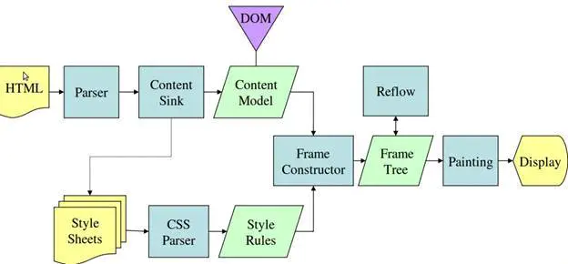

## **浏览器工作原理**

[一篇好文地址](https://www.html5rocks.com/zh/tutorials/internals/howbrowserswork/)

## **目录**

- [浏览器主要结构](#main-components)

- [呈现引擎](#rendering-engine)

  

---

### <span id="main-components">**浏览器主要结构**</span>

&emsp;&emsp;浏览器主要组成部分如下：

- **用户界面**：包括地址栏、前进/后退按钮、书签菜单等。除了浏览器主窗口显示的您请求的页面外，其他显示的各个部分都属于用户界面；
- **浏览器引擎**：在用户界面和呈现引擎之间传送指令；
- **呈现引擎**：负责显示请求的内容。如果请求的内容是 HTML，它就负责解析 HTML 和 CSS 内容，并将解析后的内容显示在屏幕上；
- **网络**：用于网络调用，比如 HTTP 请求。其接口与平台无关，并为所有平台提供底层实现；
- **用户界面后端**：用于绘制基本的窗口小部件，比如组合框和窗口。其公开了与平台无关的通用接口，而在底层使用操作系统的用户界面方法；
- **JavaScript解释器**：用于解析和执行 JavaScript 代码；
- **数据存储**：这是持久层。浏览器需要在硬盘上保存各种数据，例如 Cookie。新的 HTML 规范 (HTML5) 定义了“网络数据库”，这是一个完整（但是轻便）的浏览器内数据库。


&emsp;&emsp;最新的Chrome浏览器的进程有五种：

- 一个浏览器主进程

&emsp;&emsp;界面显示、用户交互、子进程管理、存储功能

- 一个网络（NetWork）进程

&emsp;&emsp;网络资源的加载

- 一个GPU进程

&emsp;&emsp;绘制UI界面

- 多个渲染进程

&emsp;&emsp;将HTML、CSS和JavaScript转换为用户可以与之交互的网页；

&emsp;&emsp;渲染引擎Blink和JavaScript引擎V8都是运行在该进程中；

&emsp;&emsp;默认情况下，Chrome会为每个Tab标签创建一个渲染进程，出于安全考虑，渲染进程都是运行在沙箱模式下，不能获取系统权限对硬盘进行读写等；

```
注意：

1. 同一站点的Tab页共用一个渲染进程，新页面会复用父页面的渲染进程，这一策略就是**同源策略**，所以同一站点需要协议、域名、端口都相同；
2. 渲染进程还包含了很多子线程，有合成线程（Compositor）、合成图块栅格化线程（Compositor Tile Worker）、主线程。
```

- 多个插件进程：插件容易崩溃，因此做一个隔离，免得影响整个页面

---

### <span id="rendering-engine">**呈现引擎**</span>

<font color="#f70404">&emsp;&emsp;注：和大多数浏览器不同，Chrome浏览器的每个标签页都分别对应一个呈现引擎实例，每个标签页都是一个独立的进程</font>


Webkit内核的渲染主流程：


Geoko内核的渲染主流程：



对比来看主要在css的解析环节有区别