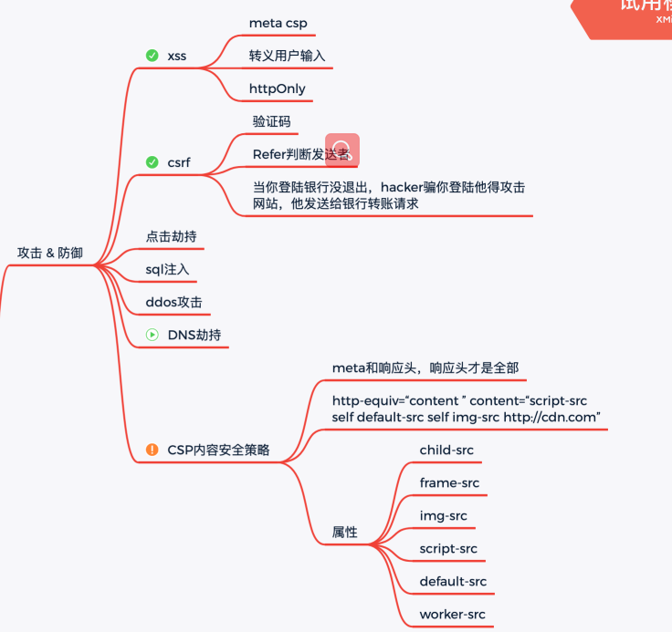

# 攻击&防御

文章参考：

[[秃破前端面试] —— Web 安全相关](https://juejin.im/post/6844904029416357896)

[常见六大Web安全攻防解析](https://juejin.im/post/6844903772930441230#heading-5)



## 前言

今年的面试难度据说涨了好几番，但是我想必考点应该还是那些。那web安全应该算是必考项了吧。当问及web攻击方式有哪些，如何预防的时候，各位小伙伴是不是一脸懵逼呢？今天，我们就来梳理一下，当涉及到网络安全的时候，我们应该如何回答？

## 问：说说网络安全有哪些攻击方式，攻击方式的特点是什么？如何预防？

答：

网络攻击方式有很多种，最常见的属于跨站脚本攻击和跨站请求伪造了。

跨站脚本攻击，缩写为xss。从攻击时限分分为两种：持续型和非持续性。

持续型是通过前端入口将攻击代码传递到数据库，导致使用该系统的人，一旦进入相关攻击页面，就会被攻击。除非数据库中的相关攻击代码被清除。

非持久型是通过前端入口将攻击代码提交给服务器，服务器执行相关而已代码，获取cookie，或者其他账户信息。如盗取qq号。

跨站请求伪造，缩写为crsf。csrf是通过用户登陆后服务端返回的cookie，进行伪造身份，从而发起的一种攻击，比如伪造你的身份去引号取钱。所以crsf的后果往往是不可逆的，但是他的执行条件比较多。需要用户在登录条件下访问了第三方的病毒网站，且需要攻击者了解被攻击网站的内部代码，从而摸清哪里有csrf漏洞。

除了这两种最常见的之外，还有一些，比如：点击劫持，url跳转漏洞

点击劫持，就是在一些敏感操作，比如登录的按钮上门，隐藏一个透明的iframe，诱导用户点击。

url跳转漏洞，就是在点击网站链接进行跳转的时候，没有对跳转的地址进行合法性验证，导致用户跳转到钓鱼页面。


# 网络攻击


网络攻击方式有很多种，最常见的属于跨站脚本攻击和跨站请求伪造了。

## xss

跨站脚本攻击，缩写为xss。从攻击时限分分为两种：持续型和非持续性。

### XSS攻击的分类

1.非持久型攻击: 非持久型xss攻击是一次性的，仅对当次的页面访问产生影响。非持久型xss攻击要求用户访问一个被攻击者篡改后的链接，用户访问该链接时，被植入的攻击脚本被用户游览器执行，从而达到攻击目的。
2.持久型攻击: 持久型xss，会把攻击者的数据存储在服务器端，攻击行为将伴随着攻击数据一直存在

**也可以分成三类:**

1. 反射型：经过后端，不经过数据库
2. 存储型：经过后端，经过数据库
3. DOM：不经过后端,DOM—based XSS漏洞是基于文档对象模型Document Objeet Model,DOM)的一种漏洞,dom - xss是通过url传入参数去控制触发的。

### 如何防范

将用户输入的可能产生XSS攻击的尖括号,引号等进行转义(不要相信任何用户的输入,都要验证或转义)

参考：[什么是XSS攻击，XSS攻击可以分为哪几类？如何防范XSS攻击？](https://github.com/YvetteLau/Step-By-Step/issues/18)

## crsf

跨站请求伪造，缩写为crsf。csrf是通过用户登陆后服务端返回的cookie，进行伪造身份，从而发起的一种攻击，比如伪造你的身份去引号取钱。所以crsf的后果往往是不可逆的，但是他的执行条件比较多。需要用户在登录条件下访问了第三方的病毒网站，且需要攻击者了解被攻击网站的内部代码，从而摸清哪里有csrf漏洞。

>  CSRF,跨站请求伪造。攻击者诱导用户进入第三方网站，然后第三方网站向被攻击网站发送跨站请求。如果用户在被攻击网站中保存了登录状态，那么攻击网站就可以利用这个登陆状态绕过被攻击网站的后台验证，从而冒充用户向服务器执行一些操作。

如何防范：

1.同源检查，服务器检查请求来源

2.设置cookie同源，即设置cookie为samesite。可以让 Cookie 在跨站请求时不会被发送，从而可以阻止跨站请求伪造攻击（CSRF）

3.使用token代替cookie来进行身份验证

**为什么提倡用token代替cookie来进行身份验证**

浏览器不会自动携带token，但是会自动携带cookie

([第 28 题：cookie 和 token 都存放在 header 中，为什么不会劫持 token？](https://github.com/Advanced-Frontend/Daily-Interview-Question/issues/31#) )

参考：

[问：说说网络安全有哪些攻击方式，攻击方式的特点是什么？如何预防？](https://github.com/jiangxiaoyu66/knowledgeBase/blob/master/%E6%A6%82%E5%BF%B5%E9%A2%98/%E7%BD%91%E7%BB%9C.md)

[什么是 CSRF 攻击？如何防范 CSRF 攻击？](https://github.com/a1029563229/InterviewQuestions/tree/master/javascript/42)

[浏览器系列之 Cookie 和 SameSite 属性](https://github.com/mqyqingfeng/Blog/issues/157#)

## 点击劫持，url跳转

除了这两种最常见的之外，还有一些，比如：点击劫持，url跳转漏洞

点击劫持，就是在一些敏感操作，比如登录的按钮上门，隐藏一个透明的iframe，诱导用户点击。

url跳转漏洞，就是在点击网站链接进行跳转的时候，没有对跳转的地址进行合法性验证，导致用户跳转到钓鱼页面。


# 跨域

参考：

[前端面试11：通讯类](https://juejin.cn/post/6844903731276988424#heading-1)


## Q：什么是跨域通信？

一个域下的文档或脚本试图去请求另一个域下的资源

## Q：什么是同源策略？

1. 同源：协议、域名、端口
2. 非同源的限制：
   1. cookie、localStorage、indexDB无法读取
   2. DOM无法获得
   3. Ajax 请求不能发送

## Q：前后端通信有哪些？

1. Ajax ： 同源下的通信方式
2. WebSocket：不受同源策略限制
3. CORS：支持跨域通信，也支持同源通信

## Q：如何创建创建Ajax？

```js
// 完整版
function ajax(opt) {
    if(!opt.url) return;
    var xhr = XMLHttpRequest
        ? new XMLHttpRequest()
        : new ActiveXObject('Microsoft.XMLHTTP');
     var data = opt.data,
         url = opt.url,
         type = opt.type.toUpperCase(),
         dataArr = [];
     for (var k in data) {
         dataArr.push(k + '=' + data[k]);
     }
     if (type === 'GET') {
         url = url + '?' + dataArr.join('&');
         xhr.open(type, url.replace(/\?$/g, ''), true);
         xhr.send();
     }
     if (type === 'POST') {
         xhr.open(type, url, true);
         xmlhttp.setRequestHeader('Content-type', 'application/x-www-form-urlencoded');
         xhr.send(dataArr.join('&'));
     }
     xhr.onload = function () {
         if (xhr.status === 200 || xhr.status === 304) {
             var res;
             if (opt.success && opt.success instanceof Function) {
                 res = xhr.responseText;
                 if (typeof res ==== 'string') {
                     res = JSON.parse(res);
                     opt.success.call(xhr, res);
                 }
             }
         } else {
             if (opt.error && opt.error instanceof Function) {
                 opt.error.call(xhr, res);
             }
         }
     };
}
// 简易版，只考虑GET方式
var xhr = new XMLHttpRequest();
var url = '/test';
xhr.open('GET', url, true);
/**
 * 监听服务端跟客户端通信的过程和进度
 */
xhr.onreadystatechange = function () {
    /**
     * 每当 readyState 改变时，就会触发 onreadystatechange 事件。
     * 4: 请求已完成，且响应已就绪
     */
    if (xhr.readyState === 4) {
        // 200 成功
        if (xhr.status === 200) {
            console.log(xhr);
        } else {
            console.log('error');
        }
    }
}
xhr.send();//发起客户端请求

```

## Q：跨域解决方案有哪些？

### 方案1：document.domain：

1. 场景：两个网页一级域名相同，只是二级域名不同
2. 方案：浏览器允许通过设置document.domain共享 Cookie。这种方法只适用于 Cookie 和 iframe 窗口，LocalStorage 和 IndexDB 无法通过这种方法

### 方案2：通过jsonp跨域

```js
// 客户端实现：
<script>
    var script = document.createElement('script');
    script.type = 'text/javascript';
 
    // 传参并指定回调执行函数为onBack
    script.src = 'http://www.domain2.com:8080/login?user=admin&callback=onBack';
    document.head.appendChild(script);
 
    // 回调执行函数
    function onBack(res) {
        alert(JSON.stringify(res));
    }
</script>
// 服务端（返回时即执行全局函数）
onBack({"status": true, "user": "admin"})
```

### 方案三：location.hash

场景：当前页面 A 通过iframe或frame嵌入了跨域的页面 B

```
// 在A中伪代码如下：
var B = document.getElementsByTagName('iframe');
B.src = B.src + '#' + 'data';
// 在B中的伪代码如下：
window.onhashchange = function () {
  var data = window.location.hash;
};
复制代码
```

### 方案四：postMessage

HTML5引入跨文档通信API，这个API为window对象新增了一个window.postMessage方法，允许跨窗口通信，不论这两个窗口是否同源

```
// 例如，窗口A(http:A.com)向跨域的窗口B(http:B.com)发送信息
var popup = window.open('http://B.com', 'title');
popup.postMessage('Hello World!', 'http://B.com');
// 在窗口B中监听
window.addEventListener('message', function (event) {
      console.log(event.origin);    // 消息发向的网址
      console.log(event.source);    // 发送消息的窗口
      console.log(event.data);      // 消息内容
}, false);
复制代码
```

### 方案五：WebSocket

```
var ws = new WebSocket('wss://echo.websocket.org');
ws.onopen = function (evt) {
    console.log('Connection open ...');
    ws.send('Hello WebSockets!');
};
ws.onmessage = function (evt) {
    console.log('Received Message: ', evt.data);
    ws.close();
};
ws.onclose = function (evt) {
    console.log('Connection closed.');
};
复制代码
```

### 方案六：CORS

```
  fetch('/some/url/', {
      method: 'get',
  }).then(function (response) {
  }).catch(function (err) {
    // 出错了，等价于 then 的第二个参数，但这样更好用更直观
  });
```

