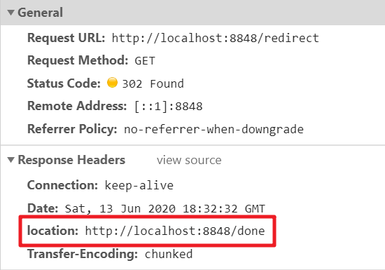

## 应用层（HTTP,HTTPS,DNS）

### HTTP

#### HTTP

推荐阅读：[http](https://github.com/semlinker/awesome-http#http-%E9%9D%A2%E8%AF%95)

##### 简述HTTP协议

HTTP 是一个在**客户端和服务器之间传输**文字、图片、音频、视频等超文本数据的**约定和规范**。

默认使用 80 端口，它使用 **TCP** 作为传输层协议，保证了数据传输的可靠性。

##### HTTP的特点，他的缺点

**特点：**

1. 简单快速。客户端请求服务时，只需传送方法和路径。由于 HTTP 协议简单，因此通信快。
2. 灵活。可以传送任意类型的数据
3. 无连接。每完成一次请求即断开连接。
4. 无状态。HTTP 请求不会保留之前请求的信息，每次请求都是独立的。

**缺点：**

- **通信使用明文（不加密），内容可能会被窃听**

- 不验证通信方的身份，因此有可能遭遇伪装；

- 无法证明报文的完整性，有可能已遭篡改；

  参考：[面试常问的http的缺点](https://juejin.cn/post/6844903744593723400#heading-0)


##### 简述HTTP请求报文

HTTP 请求报文由**请求行**、**请求头**、**空行** 和 **请求体(请求数据)** 4 个部分组成，如下图所示：


请求行 = 请求方法+ URL+ HTTP 协议版本，它们之间用空格分开。

请求头 由 多个键值对 组成，一行一个键值对

空行：跟在最后一个请求头后面，发送回车符和换行符，通知服务器以下不再有请求头。

请求体：存放请求数据，在GET请求中不能使用


HTTP响应报文由**状态行、响应头、空行和响应体**4 个部分组成，如下图所示：


参考：

 [HTTP 请求报文](https://github.com/semlinker/awesome-http#http-%E8%AF%B7%E6%B1%82%E6%8A%A5%E6%96%87)

[HTTP 响应报文](https://github.com/semlinker/awesome-http#http-%E5%93%8D%E5%BA%94%E6%8A%A5%E6%96%87)


##### 简述HTTP请求的方法字段，get和post的区别

http/1.0规定了三种请求方法：GET、POST、HEAD

http/1.1新增了五种请求方法：OPTIONS、PUT、DELETE、TRACE、CONNECT

- **GET**：常用于获取数据，请求获取Request-URI所标识的资源
- **POST**：提交数据，在Request-URI所标识的资源后附加新的数据
- **PUT**：修改数据，请求服务器存储一个资源，并用Request-URI作为其标识
- **DELETE**：请求服务器删除对应所标识的资源，但注意：客户端无法保证删除操作一定会被执行，因为HTTP规范允许服务器在不通知客户端的情况下撤销请求
- **HEAD**：与GET类似（获取资源的元信息），但只请求获取有Request-URI所标识的资源的响应消息报头
- **OPTIONS**：列出可对资源实行的请求方式，用来跨域请求，成功后会在HTTP响应头中包含一个名为“Allow”的头，其值就是当前支持的请求方式
- **TRACE**：请求服务器回送收到的请求信息，主要用于测试或诊断。服务端在相应主体中携带它收到的原始请求报文的最终模样，客户端可以查看HTTP请求报文在发送过程中是否被修改
- **CONNECT**：建立连接隧道，用于代理服务器

**get和post的区别**

  着重讲下GET和POST的区别？

   >- **GET和POST的区别**
   >
   >1. get只产生一个TCP数据包，POST产生两个
   >  1. GET产生一个TCP数据包，浏览器会把http header和data一并发送，服务器响应200 OK并返回数据
   >  2. POST产生两个TCP数据包，浏览器先发送http header，服务器响应100 continue，浏览器再发送data，服务器响应200 OK并返回数据（火狐只发送一次）
   >
   >2. 参数的问题
   >
   >  1. GET参数暴露在url中，不安全
   >  2. GET在url中传参长度有限制，post没有
   >  3. GET只接受ASCII字符，POST无限制
   >  4. GET请求参数被完整保留在浏览记录中，POST的参数不会
   >
   >3. 从幂等性的角度来看，GET是幂等的，而POST不是
   >
   >  注意：幂等是指，同样的请求被执行一次与连续执行多次的效果是一样的，服务器的状态也是一样的。[参考这里](https://developer.mozilla.org/zh-CN/docs/Glossary/幂等)
   >
   >
   >
   >
   >
   >- **PUT和POST**
   >
   >  PUT和POST方法作用类似，不同在于PUT是幂等的。当多次发送相同的POST请求，服务器上的资源数目可能会增加；而PUT请求后服务器上的资源数目不会增加，每次PUT都会覆盖前一次PUT的资源
   >
   >

**PUT和POST区别**

  PUT和POST方法作用类似，不同在于PUT是幂等的。当多次发送相同的POST请求，服务器上的资源数目可能会增加；而PUT请求后服务器上的资源数目不会增加，每次PUT都会覆盖前一次PUT的资源

##### HTTP状态码

状态代码由三位数字组成，第一个数字定义了响应的类别，且有五种可能取值：

- 1xx：指示信息 – 表示请求已接收，继续处理
- 2xx：成功 – 表示请求已被成功接收
- 3xx：重定向 – 要完成请求必须进行更进一步的操作
- 4xx：客户端错误 – 请求有语法错误或请求无法实现
- 5xx：服务器错误 – 服务器未能实现合法的请求

常见状态代码、状态描述的说明如下：

- **200** OK：客户端请求成功
- **204** No Content：没有新文档，浏览器应该继续显示原来的文档
- 206 Partial Content：客户发送了一个带有Range头的GET请求，服务器完成了它
- **301** Moved Permanently：永久重定向
- 302 Found：所请求的页面已经临时转移至新的url
- **304 Not Modified：协商缓存命中**
- **400** Bad Request：客户端请求有语法错误，不能被服务器所理解
- 401 Unauthorized：请求未经授权，这个状态代码必须和WWW-Authenticate报头域一起使用
- 403 Forbidden：对被请求页面的访问被禁止
- **404** Not Found：请求资源不存在
- **500** Internal Server Error：服务器发生不可预期的错误
- 503 Server Unavailable：请求未完成，服务器临时过载或当机，一段时间后可能恢复正常

#### HTTP2.0

> HTTP/2的新特性:二进制协议、 多路复用、数据流、 头信息压缩、服务器推送

**二进制协议** HTTP/2 则是一个彻底的二进制协议，头信息和数据体都是二进制，并且统称为"帧"，可以分为头信息帧和数据帧。 帧的概念是它实现多路复用的基础。

**多路复用** HTTP/2 实现了多路复用，HTTP/2 仍然复用 TCP 连接，但是在一个连接里，客户端和服务器都可以同时发送多个请求或回 应，而且不用按照顺序一一发送，这样就避免了"队头堵塞"的问题。

**数据流** HTTP/2 将每个请求或回应的所有数据包，称为一个数据流。每 个数据流都有一个独一无二的编号。数据包发送的时候，都必须标记数据流 ID ，用来区分它属于哪个数据流。

**头信息压缩** HTTP/2 实现了头信息压缩，由于 HTTP 1.1 协议不带有状态，每次请求都必须附上所有信息。所以，请求的很多字段都是 重复的，比如 Cookie 和 User Agent ，一模一样的内容，每次请求都必须附带，这会浪费很多带宽，也影响速度。HTTP/2 对这一点做了优化，引入了头信息压缩机制。

**服务器推送** HTTP/2 允许服务器未经请求，主动向客户端发送资源，这叫做服务器推送。


详细的可以看下[HTTP----HTTP2.0新特性](https://juejin.cn/post/6844903545532071943#heading-8)


#### 如何解决HTTP队头阻塞的问题

http2.0多路复用，实现一个连接里可以发送和接受多个请求，且不用按照顺序一个一个发送


## 状态码


### 重定向的基本流程

[重定向的基本流程](https://blog.lishunyang.com/2020/06/redirect.html#重定向的基本流程)

重定向的流程是这样的（以302临时重定向为例，因为最常用，下同）：

```text
client               server
  |      request       |
  |------------------->|
  |        302         |
  |<-------------------|
  |     new request    |
  |------------------->|
  |      response      |
  |<-------------------|
```

可见实际上是发了2次请求，第一次请求后，服务端返回302状态码，前端浏览器再朝着跳转目的地址发起一个新的请求。跳转的目的地址是在第一次请求响应的location头部指定的。



location没有限制一定得是同域的URL，因此跳转到其他域下面是可以的。

需要注意2点： 

1. 要想能够成功重定向，状态码和location头部二者缺一不可。
2. 重定向这个操作是后端控制的，浏览器会自动识别跳转场景然后重新向跳转地址发起新请求。整个过程对前端是透明的，也就是在前端眼中就像是只有一次请求一样，仿佛前面的请求是空气。