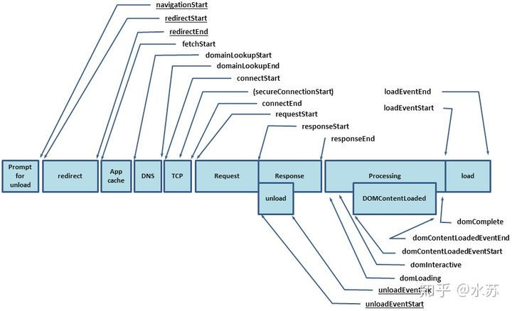
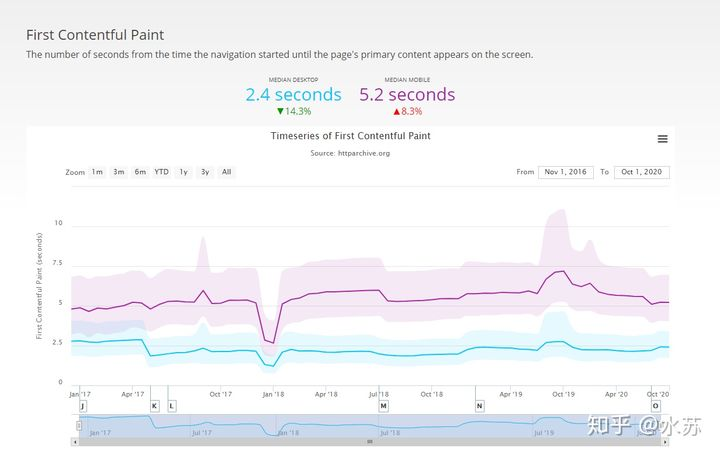

参考：

https://juejin.cn/post/6911472693405548557#heading-37


# 简单流程

### 用户输入

  【主进程处理】

1. 判断输入是否符合 URL 规则，不符合判断就是搜索内容的关键词，用默认搜索引擎搜索；符合的话加上协议拼接完成 URL；
2. 浏览器进程通过进程间通信（IPC）把 URL 请求转发给网络进程；
3. 有一个 beforeunload 事件，让用户确认是否离开；

### **网络部分**

1. 构建请求行
2. 查找强缓存，有则使用无则下一步
3. `DNS`(Domain Name System)查找，查找过程：浏览器自身的DNS缓存-> OS自身DNS缓存-> 读取host文件->本地域服务器->权限域名服务器->根域名服务器
4. 建立 TCP 连接
   1. 三次握手
   2. 四次挥手
5. 服务端返回数据
   1. 是否断开TCP连接要看Connection字段是否为Keep-Alive

### **解析部分**

1. 构建DOM树
   1. 标记化算法
   2. 建树算法
2. 样式计算
   1. 格式化样式表
   2. 标准化样式表
   3. 计算每个点的具体位置
3. 生成布局树 Layuot Tree
   1. 遍历DOM树节点
   2. 计算布局树节点的坐标位置

### **渲染部分**

1. 生成图层树 Layer Tree
2. 生成绘制列表
3. 生成图块并栅格化
4. 显示器显示内容

# 从整体过程看性能优化

从访问开始，用户可能会经历类似「查询缓存 -> 发送请求 -> 等待响应 -> 页面解析 -> 下载并处理各类静态资源 -> 运行时 -> 预加载（等待后续的请求）」这样一个不断往复的“旅程” 

所以从这个角度考虑，大致可以分成7个阶段：

1. 缓存
2. 请求
3. 服务端响应
4. 页面解析
5. 下载静态资源
6. 程序运行
7. 等待后续请求

接下来，我们就聊聊，这7个阶段各个有哪些可优化的方向呢？


## 缓存

本地存储

内存

http缓存

>### 1、http缓存
>
>#### keep-alive
>
>判断是否开启：看`response headers`中有没有`Connection: keep-alive` 。开启以后，看`network`的瀑布流中就没有 `Initial connection`耗时了
>
>nginx设置keep-alive（默认开启）
>
>```
># 0 为关闭
>#keepalive_timeout 0;
># 65s无连接 关闭
>keepalive_timeout 65;
># 连接数，达到100断开
>keepalive_requests 100;
>复制代码
>```
>
>#### Cache-Control / Expires / Max-Age
>
>设置资源是否缓存，以及缓存时间
>
>#### Etag / If-None-Match
>
>资源唯一标识作对比，如果有变化，从服务器拉取资源。如果没变化则取缓存资源，状态码304，也就是协商缓存
>
>#### Last-Modified / If-Modified-Since
>
>通过对比时间的差异来觉得要不要从服务器获取资源
>
>更多HTTP缓存参数可参考：[使用 HTTP 缓存：Etag, Last-Modified 与 Cache-Control](https://link.juejin.cn/?target=https%3A%2F%2Fharttle.land%2F2017%2F04%2F04%2Fusing-http-cache.html)
>
>
>作者：俊劫
>链接：https://juejin.cn/post/6911472693405548557
>
>


## http请求

http2.0

缓存

service worker

### 请求

避免重复请求（比如重定向）

DNS预解析

预先建立连接

服务端使用CDN

减少cookie传输

>### 1、减少cookie传输
>
>cookie传输会造成带宽浪费，可以：
>
>- 减少cookie中存储的东西
>- 静态资源不需要cookie，可以采用其他的域名，不会主动带上cookie。
>
>


### 服务端响应


## 页面解析

防止阻塞

> JavaScript 会阻塞 DOM 构建，而 CSSOM 的构建又回阻塞 JavaScript 的执行。

所以这就是为什么在优化的最佳实践中，我们基本都推荐把 CSS 样式表放在 `<head>` 之中（即页面的头部），把 JavaScript 脚本放在 `<body>` 的最后（即页面的尾部）。

使用 defer 和 async

文档压缩：HTML 的文档大小也会极大影响响应体下载的时间。一般会进行 HTML 内容压缩（uglify）的同时，使用文本压缩算法（例如 gzip）进行文本的压缩。


减少重绘和回流（骨架屏）


## 页面静态资源

### JS

按需加载

控制大小（http1.0的gzip压缩，trss-shaking：去除不必要代码进行打包）

删除不必要代码（组件中，pollyfill中），避免长任务，基础库打包合并


### 图片

懒加载

小图标使用base64

>### 内联 base64
>
>还有一种方式是将图片转为 base64 字符串，并将其内联到页面中返回，即将原 url 的值替换为 base64。这样，当浏览器解析到这个的图片 url 时，就不会去请求并下载图片，直接解析 base64 字符串即可。
>
>但是这种方式的一个缺点在于相同的图片，相比使用二进制，变成 base64 后体积会增大 33%。而全部内联进页面后，也意味着原本可能并行加载的图片信息，都会被放在页面请求中（像当于是串行了）。同时这种方式也不利于复用独立的文件缓存。所以，使用 base64 需要权衡，常用于首屏加载 CRP 或者骨架图上的一些小图标。
>
>

使用合适的图片格式

使用合适的图片格式不仅能帮助你减少不必要的请求流量，同时还可能提供更好的图片体验。

图片格式是一个比较大的话题，[选择合适的格式](https://www.sitepoint.com/what-is-the-right-image-format-for-your-website/)[7]有利于性能优化。这里我们简单总结一些。

**1) 使用 WebP：**

考虑[在网站上使用 WebP 格式](https://css-tricks.com/using-webp-images/)[8]。在有损与无损压缩上，它的表现都会优于传统（JPEG/PNG）格式。WebP 无损压缩比 PNG 的体积小 26%，webP 的有损压缩比同质量的 JPEG 格式体积小 25-34%。同时 WebP 也支持透明度。下面提供了一种兼容性较好的写法。

```html
<picture>
    <source type="image/webp" srcset="/static/img/perf.webp">
    <source type="image/jpeg" srcset="/static/img/perf.jpg">
    
</picture>
```

**2) 使用 SVG 应对矢量图场景：**

在一些需要缩放与高保真的情况，或者用作图标的场景下，使用 SVG 这种矢量图非常不错。有时使用 SVG 格式会比相同的 PNG 或 JPEG 更小。

**3) 使用 video 替代 GIF：**

在[兼容性允许](https://caniuse.com/#feat=video)的情况下考虑，可以在想要动图效果时使用视频，通过静音（muted）的 video 来代替 GIF。相同的效果下，[GIF 比视频（MPEG-4）大 5～20 倍](https://youtu.be/reztLS3vomE?t=158)。[Smashing Magazine 上有篇文章](https://www.smashingmagazine.com/2018/11/gif-to-video/)[9]详细介绍使用方式。


## 白屏加载和首屏加载时间的区别

白屏时间是指浏览器从响应用户输入网址地址，到浏览器开始显示内容的时间。

首屏时间是指浏览器从响应用户输入网址地址，到首屏内容渲染完成的时间，此时整个网页不一定要全部渲染完成，但在当前视窗的内容需要。

白屏时间是首屏时间的一个子集。


## 项目性能优化

### 1. 编码优化

编码优化，指的就是 在代码编写时的，通过一些 **最佳实践**，提升代码的执行性能。通常这并不会带来非常大的收益，但这属于 **程序猿的自我修养**，而且这也是面试中经常被问到的一个方面，考察自我管理与细节的处理。

- **数据读取**:

  - 通过作用域链 / 原型链 读取变量或方法时，需要更多的耗时，且越长越慢；

  - 对象嵌套越深，读取值也越慢；

  - 最佳实践:

    - 尽量在局部作用域中进行 **变量缓存**；
- 避免嵌套过深的数据结构，**数据扁平化** 有利于数据的读取和维护；
  
- **循环**: 循环通常是编码性能的关键点；

  - 代码的性能问题会再循环中被指数倍放大；

  - 最佳实践:

    - 尽可能 减少循环次数；

      - 减少遍历的数据量；
- 完成目的后马上结束循环；
      
- 避免在循环中执行大量的运算，避免重复计算，相同的执行结果应该使用缓存；
    
- js 中使用 **倒序循环** 会略微提升性能；
    
    - 尽量避免使用 for-in 循环，因为它会枚举原型对象，耗时大于普通循环；

- **条件流程性能**: Map / Object > switch > if-else

```
// 使用 if-else
if(type === 1) {

} else if (type === 2) {

} else if (type === 3) {

}

// 使用 switch
switch (type) {
	case 1:
		break;4
	case 2:
		break;
	case 3:
		break;
    default:
        break;
}

// 使用 Map
const map = new Map([
	[1, () => {}],
	[2, () => {}],
	[3, () => {}],
])
map.get(type)()

// 使用 Objext
const obj = {
	1: () => {},
	2: () => {},
	3: () => {},
}
obj[type]()
复制代码
```

- **减少 cookie 体积**: 能有效减少每次请求的体积和响应时间；

  - 去除不必要的 cookie；
  - 压缩 cookie 大小；
  - 设置 domain 与 过期时间；

- **dom 优化**:

  - **减少访问 dom 的次数**，如需多次，将 dom 缓存于变量中；

  - 减少重绘与回流

    :

    - 多次操作合并为一次；
    - 减少对计算属性的访问；
      - 例如 offsetTop， getComputedStyle 等
      - 因为浏览器需要获取最新准确的值，因此必须立即进行重排，这样会破坏了浏览器的队列整合，尽量将值进行缓存使用；
    - 大量操作时，可将 dom 脱离文档流或者隐藏，待操作完成后再重新恢复；
    - 使用`DocumentFragment / cloneNode / replaceChild`进行操作；

  - 使用事件委托，避免大量的事件绑定；

- **css 优化**:

  - **层级扁平**，避免过于多层级的选择器嵌套；
  - **特定的选择器** 好过一层一层查找:  .xxx-child-text{} 优于 .xxx .child .text{}
  - **减少使用通配符与属性选择器**；
  - **减少不必要的多余属性**；
  - 使用 **动画属性** 实现动画，动画时脱离文档流，开启硬件加速，优先使用 css 动画；
  - 使用 `<link>` 替代原生 @import；

- **html 优化**:

  - **减少 dom 数量**，避免不必要的节点或嵌套；

  - 避免``空标签

    ，能减少服务器压力，因为 src 为空时，浏览器仍然会发起请求

    - IE 向页面所在的目录发送请求；
    - Safari、Chrome、Firefox 向页面本身发送请求；
    - Opera 不执行任何操作。

  - 图片提前 **指定宽高** 或者 **脱离文档流**，能有效减少因图片加载导致的页面回流；

  - **语义化标签** 有利于 SEO 与浏览器的解析时间；

  - 减少使用 table 进行布局，避免使用`<br />`与`<hr />`；

### 2. 页面基础优化

- 引入位置: css 文件<head>中引入， js 文件<body>底部引入；

  - 影响首屏的，优先级很高的 js 也可以头部引入，甚至内联；

- **减少请求** (http 1.0 - 1.1)，合并请求，正确设置 http 缓存；

- 减少文件体积:

  - 删除多余代码:

    - tree-shaking
- UglifyJs
    - code-spliting
  
  - **混淆 / 压缩代码**，开启 gzip 压缩；
  
  - 多份编译文件按条件引入:

    - 针对现代浏览器直接给 ES6 文件，只针对低端浏览器引用编译后的 ES5 文件；
- 可以利用`<script type="module"> / <script type="module">`进行条件引入用
    
- **动态 polyfill**，只针对不支持的浏览器引入 polyfill；
  
- 图片优化:

  - 根据业务场景，与UI探讨选择 **合适质量，合适尺寸**；
- 根据需求和平台，选择 **合适格式**，例如非透明时可用 jpg；非苹果端，使用 webp；
  - 小图片合成 **雪碧图**，低于 5K 的图片可以转换成 **base64** 内嵌；
  - 合适场景下，使用 **iconfont** 或者 **svg**；
  
- 使用缓存:

  - **浏览器缓存**: 通过设置请求的过期时间，合理运用浏览器缓存；

  - CDN缓存: 静态文件合理使用 CDN 缓存技术；

    - HTML 放于自己的服务器上；
- 打包后的图片 / js / css 等资源上传到 CDN 上，文件带上 hash 值；
    - 由于浏览器对单个域名请求的限制，可以将资源放在多个不同域的 CDN 上，可以绕开该限制；
  
  - **服务器缓存**: 将不变的数据、页面缓存到 内存 或 远程存储(redis等) 上；
  
  - **数据缓存**: 通过各种存储将不常变的数据进行缓存，缩短数据的获取时间；

### 3. 首屏渲染优化

- **css / js 分割**，使首屏依赖的文件体积最小，内联首屏关键 css / js；

- 非关键性的文件尽可能的 **异步加载和懒加载**，避免阻塞首页渲染；

- 使用`dns-prefetch / preconnect / prefetch / preload`等浏览器提供的资源提示，加快文件传输；

- 谨慎控制好 Web字体，一个大字体包足够让你功亏一篑；

  - 控制字体包的加载时机；
- 如果使用的字体有限，那尽可能只将使用的文字单独打包，能有效减少体积；
  
- 合理利用 Localstorage / server-worker 等存储方式进行 **数据与资源缓存**；

- 分清轻重缓急:

  - 重要的元素优先渲染；
- 视窗内的元素优先渲染；
  
- 服务端渲染(SSR):

  - 减少首屏需要的数据量，剔除冗余数据和请求；
- 控制好缓存，对数据/页面进行合理的缓存；
  - 页面的请求使用流的形式进行传递；
  
- 优化用户感知:

  - 利用一些动画 **过渡效果**，能有效减少用户对卡顿的感知；

  - 尽可能利用 **骨架屏(Placeholder) / Loading** 等减少用户对白屏的感知；

  - 动画帧数尽量保证在 **30帧** 以上，低帧数、卡顿的动画宁愿不要；

  - js 执行时间避免超过 100ms，超过的话就需要做:

    - 寻找可 缓存 的点；
- 任务的 分割异步 或 web worker 执行；


作者：郭东东
链接：https://juejin.cn/post/6844903830979608584
来源：掘金
著作权归作者所有。商业转载请联系作者获得授权，非商业转载请注明出处。


## 白屏加载和首屏加载时间的区别

白屏时间是指浏览器从响应用户输入网址地址，到浏览器开始显示内容的时间。

首屏时间是指浏览器从响应用户输入网址地址，到首屏内容渲染完成的时间，此时整个网页不一定要全部渲染完成，但在当前视窗的内容需要。

白屏时间是首屏时间的一个子集。

### 被忽视的首屏加载

用户体验对web网页来说很重要，而首屏加载是用户体验中最重要的环节之一，可能没有之一。然而现在的很多前端开发者，都没能重视对首屏加载的优化。

正常来说，首屏加载时间不应该超过2s。有些成熟的网页比如京东和淘宝，虽然页面模块非常多且复杂，但通过优化，首屏加载时间却不长。

如果一个页面完成首屏加载需要5秒以上，可能用户下次就从心理排斥打开这个页面。换言之，首屏加载时间对用户留存率影响很大。

### 如何计算白屏时间和首屏时间

可以利用`performance.timing`提供的数据：



白屏时间：`performance.timing.responseStart - performance.timing.navigationStart`

首屏时间：我们可以通过`DOMContentLoad`如下。

```js
document.addEventListener('DOMContentLoaded', (event) => {
    console.log('first contentful painting');
});
```

如果你的web是CSR（客户端渲染）的渲染方式，以上的首屏时间获取方式不一定可靠，浏览器可能在接口内容还没返回前，就触发了`window`的`DOMContentLoaded`和`load`事件，导致得出的首屏时间要早很多。所以采用客户端渲染的页面，有时需要手动去计算时间。

或者，你可以定义在某个重要组件渲染完成的那一刻就意味着完成了首屏渲染。比如，我在列表页面常常会在接口拿到`response: ListItem[]`后用`setTimeout(contentLoaded,0)`来标记首屏时间。


多久的首屏时间才算好呢？现在互联网的[平均水平](https://link.zhihu.com/?target=https%3A//httparchive.org/reports/loading-speed)是pc-2.4s，wap-5.2s。



------

## 如何优化首屏加载时间

1. cdn分发（减少传输距离）。通过在多台服务器部署相同的副本，当用户访问时，服务器根据用户跟哪台服务器距离近，来决定哪台服务器去响应这个请求。

\2. 后端在业务层的缓存。数据库查询缓存是可以设置缓存的，这个对于处于高频率的请求很有用。浏览器一般不会对`content-type: application/json`；的接口进行缓存，所以有时需要我们手动地为接口设置缓存。比如一个用户的签到状态，它的缓存时间可以设置到明天之前。

\3. 静态文件缓存方案。这个最常看到。现在流行的方式是文件hash+强缓存的一个方案。比如hash+ cache control: max-age=1年。

\4. 前端的资源动态加载：

```text
a. 路由动态加载，最常用的做法，以页面为单位，进行动态加载。
b. 组件动态加载(offScreen Component)，对于不在当前视窗的组件，先不加载。
c. 图片懒加载(offScreen Image)，同上。值得庆幸的是，越来越多的浏览器支持原生的懒
   加载，通过给img标签加上loading="lazy来开启懒加载模式。 
```

\5. 减少请求的数量。这点在http1.1的优势很明显，因为http1.1的请求是串行的（尽管有多个tcp通道），每个请求都需要往返后才能继续下个请求。此时合并请求可以减少在路途上浪费的时间，此外还会带来重复的请求头部信息（比如cookie)。在http2.0中这个问题会弱化很多，但也有做的必要。

\6. 页面使用骨架屏。意思是在首屏加载完成之前，通过渲染一些简单元素进行占位。骨架屏的好处在于可以减少用户等待时的急躁情绪。这点很有效，在很多成熟的网站（京东、淘宝、Youtube）都有大量应用。没有骨架屏的话，一个loading的菊花图也是可以的。

\7. 使用ssr渲染。

\8. 引入[http2.0](https://link.zhihu.com/?target=https%3A//www.digitalocean.com/community/tutorials/http-1-1-vs-http-2-what-s-the-difference)。http2.0对比http1.1，最主要的提升是传输性能，在接口小而多的时候会更加明显。

\9. 利用好http压缩。即使是最普通的gzip，也能把`bootstrap.min.css`压缩到原来的17%。可见，压缩的效果非常明显，特别是对于文本类的静态资源。另外，接口也是能压缩的。接口不大的话不用压缩，因为性价比低（考虑压缩和解压的时间）。


\10. 利用好script标签的[async和defer](https://link.zhihu.com/?target=https%3A//stackoverflow.com/questions/10808109/script-tag-async-defer)这两个属性。功能独立且不要求马上执行的js文件，可以加入async属性。如果是优先级低且没有依赖的js，可以加入defer属性。

\11. （少用）选择先进的图片格式。使用 WebP 的图片格式来代替现有的jpeg和png，当页面图片较多时，这点作用非常明显。把部分大容量的图片从BaseLine JPEG切换成Progressive JPEG（[理解这两者的差别](https://link.zhihu.com/?target=https%3A//images.guide/%23choosing-an-image-format)）也能缩小体积。

\12. （少用）渲染的优先级。浏览器有一套资源的加载优先级策略。也可以通过js来自己控制请求的顺序和渲染的顺序。一般我们不需要这么细粒度的控制，而且控制的代码也不好写。

\13. （少用）前端做一些接口缓存。前端也可以做接口缓存，缓存的位置有两个，一个是内存，即赋值给运行时的变量，另一个是localStorage。比如用户的签到日历（展示用户是否签到），我们可以缓存这样的接口到localStorage，有效期是当天。或者有个列表页，我们总是缓存上次的列表内容到本地，下次加载时，我们先从本地读取缓存，并同时发起请求到服务器获取最新列表。


## SSR服务端渲染和客户端渲染

最近在学习 React 的服务端渲染，于是使用 Express+React 写了一个 Demo，用于对比和客户端渲染的差异。[github 地址](https://github.com/yhlben/react-ssr-demo)

先看一下效果吧：

1、访问 [服务器端渲染 Online Demo](https://yinhengli.com:8084/)

2、我们可以看到，首屏数据很快的就显示出来了，可是页面的进度条却还在加载中（因为客户端 js 很大）。

3、当进度条加载完成后，页面才能进行交互操作（切换路由，登录等）。

4、查看网页源代码，页面内容都在页面中。

> 效果不明显的话，可以打开控制台，在 Network 栏 Disable cache，然后刷新。

通过这次简单的访问，我们就能看出服务器端渲染的 2 大特点，`首屏直出`，`SEO 友好`。

## 为什么要做服务器端渲染？

1、访问 [客户端渲染 Online Demo](https://yinhengli.com:8086/)

2、我们可以看到，首屏至少等待了 6 秒才渲染出来，这对于一般的用户，是难以容忍的。

3、不过一旦渲染完成，页面就立即可交互了（切换路由，登录等）。

4、查看网页源代码，页面只有一个空 div 容器，而没有实际内容。

通过这次访问，我们就能看出客户端渲染的特点，`首屏加载时间长`，`SEO 不友好`，但`可见即可操作`。

其实我们在访问客户端渲染的页面时，请求到的只是一个 html 空壳，里面引入了一个 js 文件，所有的内容都是通过 js 进行插入的，类似于这样：

```
<!DOCTYPE html>
<html lang="en">
  <head>
    <meta charset="UTF-8" />
    <meta name="viewport" content="width=device-width, initial-scale=1.0" />
    <meta http-equiv="X-UA-Compatible" content="ie=edge" />
    <title>ssr</title>
  </head>
  <body>
    <div id="root"></div>
    <script src="bundle.js"></script>
  </body>
</html>
```

正是因为页面是由 js 渲染出来的，所以会带来如下几个问题：

1、页面要等待 js 加载，并执行完成了才能展示，`在这期间页面展现的是白屏`。

2、爬虫不能识别 js 内容，所以抓取不到任何数据，`不利于 SEO 优化`。

为了解决这 2 个问题，我们可以使用服务器端渲染。

## React 服务器端渲染流程

之前说道，客户端渲染的页面，请求到的是一个 html 空壳，然后通过 js 去渲染页面。那如果请求到的直接是一个渲染好的页面，是不是就可以解决这 2 个问题了呢？

没错，服务器端渲染就是这个原理。

### 简化流程

1、服务器端使用 renderToString 直接渲染出包含页面信息的`静态 html`。

2、客户端根据渲染出的静态 html 进行`二次渲染`，做一些绑定事件等操作。

> 服务器端没有 DOM，Window 等概念，所以只能渲染出字符串，不能进行事件绑定，样式渲染等。
>
> 只有第一次访问页面时才使用服务器端渲染，之后会被客户端渲染接管。

## 开始写代码吧

接下来我们一起来写一个 React 服务器端渲染 Demo。

### 编写路由

这里使用 react-router 对前后端代码进行同构。

1、客户端

使用 react-router-dom 下的 `BrowserRouter` 进行前端路由控制。

2、服务器端

使用 react-router-dom 下的 `StaticRouter` 进行静态路由控制，具体操作如下：

- 使用 react-router-config 下的 matchRoutes 匹配后端路由，使用 renderRoutes 渲染匹配到的路由。
- 使用 react-router-dom/server 下的 renderToString 方法，渲染出 html 字符串，并返回给前端。

> 使用 StaticRouter 中通过 context 可以和前端页面通信，传参。

### 状态管理

在 React 中，我们常常使用 redux 来存储数据，管理状态。

1、客户端

使用 redux 进行状态管理，使用 react-redux 提供的 Provider 为组件注入 store。

2、服务器端

和客户端一样，但每一次接收到请求需产生一个新的 store，避免多个用户操作同一个 store。

### 数据请求

1、客户端

使用 axios 在 componentDidMount 中请求数据。

2、服务器端

同样使用 axios 去请求数据，但是服务器端不会触发 componentDidMount 生命周期。我们可以在后端匹配到路由的时候，进行数据请求，并把数据存入 redux 中的 store，然后渲染出包含数据的 html 页面，为了避免客户端二次请求，服务器端向 window 中注入 REDUX_STORE 数据，客户端直接使用此数据作为客户端 redux 的初始数据，以免发生数据抖动。

具体操作如下：

- 在 routes 对象上挂载一个自定义方法 loadData。
- 在服务器端 matchRoutes 后，如果有 loadData，则进行请求数据，并把请求到的数据写入 store 中。
- 服务器端等待请求完成后，再进行 renderToString 渲染。

### 样式处理

1、客户端

使用 css-loader，style-loader 打包编写好的 css 代码并插入到页面中。

2、服务器端

由于 style-loader 会插入到页面，而服务器端并没有 document 等概念，所以这里使用 isomorphic-style-loader 打包 css 代码。

- 引入 isomorphic-style-loader 后，客户端就可以通过 styles._getCss 方法获取到 css 代码。
- 通过 staticRouter 中的 context 把 css 代码传入到后端。
- 后端拼接好 css 代码，然后插入到 html 中，最后返回给前端。

### SEO 优化

SEO 主要是针对搜索引擎进行优化，为了提高网站在搜索引擎中的自然排名，但搜索引擎只能爬取落地页内容（查看源代码时能够看到的内容），而不能爬取 js 内容，我们可以在服务器端做优化。

常规的 SEO 主要是优化：`文字`，`链接`，`多媒体`

- 内部链接尽量保持相关性
- 外部链接尽可能多
- 多媒体尽量丰富

由于网页上的文字，链接，图片等信息都是产品设计好的，技术层面不能实现优化。我们需要做的就是优化页面的 title，description 等，让爬虫爬到页面后能够展示的更加友好。

这里借助于 react-helmet 库，在服务期端进行 title，meta 等信息注入。

## 你可能不需要服务器端渲染？

现在，我们成功地通过服务器端渲染解决了`首次加载白屏时间`和 `SEO 优化`。但也带来了一些问题：

- 服务器端压力增大。
- 引入了 node 中间层，可维护性增大。

以上两个问题归根结底还是钱的问题。服务器压力大，可以通过买更多的服务器来解决。可维护性增大，可以招募更多人来维护。但是对于小型团队来说，增加服务器，招募更多维护人员，都会额外增加的支出，所以在选择服务器端渲染时，要权衡好利弊。

### 解决 SEO 的另一种方法

如果只是想优化 SEO，不妨使用预渲染来实现，推荐使用 prerender 库来实现。

prerender 库的原理：`先请求客户端渲染的页面，把客户端渲染完成之后的结果，拿给爬虫看`，这样爬虫获取到的页面就是已经渲染好的页面。prerender 库在使用时会开启一个服务，通过传递 url 来解析客户端渲染页面，这就需要我们对服务器端架构进行调整。

> 1、 nginx 判断访问类型
>
> > 2.1、 用户访问 ：直接走客户端渲染
> >
> > 2.2、 爬虫访问 ：走预渲染